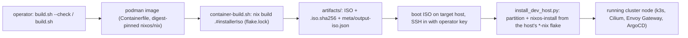

# Cluster NixOS ISO Builder

Builds the x86_64 NixOS 26.05 installer used to provision the local and public
development clusters. The build is isolated in a digest-pinned Podman image;
the exact nixpkgs revision is pinned by `flake.lock`.

This repo sits *upstream* of everything else in the monorepo. It defines no
runtime services, no networking, no DNS and holds no secrets; it only emits the
installer ISO that boots bare-metal hosts before any NixOS config, k3s, Cilium,
Envoy Gateway or ArgoCD exists on them.

## How the ISO is used downstream

The ISO is a live NixOS installer that bootstraps a target host:

1. Boot the ISO on the target hardware (a local-cluster or public-cluster node).
2. SSH into the live installer as `root`. Authentication is key-only: the
   operator SSH key(s) from `iso-authorized-keys` are the only accepted
   credentials; password and keyboard-interactive auth are refused
   (`configuration.nix`).
3. Partition and format the disks and run `nixos-install` (`nixos-install-tools`)
   via `install_dev_host.py` from `cluster-testing`, pointing at the host's flake
   in the matching `*-nix` repo (`local-cluster-nix` / `public-cluster-nix`).
   Partitioning is done imperatively with `gptfdisk` (`sgdisk`) + `mkfs`; the disk
   UUIDs are fixed and mirror each host's `hosts/dev/*/storage-map.nix`.
4. Reboot into the installed system. From there the node runs its NixOS config
   (k3s, Cilium CNI, the hostNetwork Envoy Gateway edge and Argo CD);
   none of that lives in this repo.

The tools baked into the installer exist to support exactly this bootstrap:
`gptfdisk` (`sgdisk`, partitioning; `parted` is bundled but unused), `sops`/`age` (decrypting host secrets during
install), `nixos-install-tools`, the `zfs`/`btrfs-progs`/`lvm2`/`mdadm`/
`nfs-utils` storage stacks, and `python3`/`rsync`/`git` for the install
automation. The ISO carries no secrets itself; `sops`/`age` are for the
post-boot step.



## Build

```bash
./build.sh --check
./build.sh
```

`build.sh` is the entry point; it builds the Podman image if needed and runs
`scripts/container-build.sh` inside it. That script performs the actual `nix build`
and writes the ISO, checksum and metadata to `artifacts/`.

The `artifacts/` directory and all common image formats are ignored by Git.
A reference ISO is not required; Nix builds the installer directly from the
locked inputs.

Use `REBUILD_IMAGE=1 ./build.sh` or `./build.sh --rebuild` after changing the
`Containerfile`.

## Installer contents

The image enables key-only SSH for the configured operator key. The baked-in
installer tools are the ones listed in *How the ISO is used downstream* above
(`parted` is bundled but unused; `sgdisk` does the partitioning), plus common
disk/network diagnostics.

## Updating inputs

Update deliberately inside the build container, review the lock-file diff,
then run a complete build:

```bash
# Reuse the image build.sh already built.
image="${NIX_IMAGE:-local/cluster-iso-builder:26.05}"  # match build.sh's default, or set NIX_IMAGE
podman run --rm -v "$PWD:/workspace:Z" -w /workspace \
  --entrypoint bash "$image" -lc 'nix flake update'
./build.sh
```

## SSH key & ISO signature

- **Authorized installer SSH key (#30):** in `iso-authorized-keys` (one key per
  line). Rotation = edit the file + rebuild. It is a public key (not a secret);
  if you want to keep it private, gitignore the file and populate it per build
  (the flake then only sees tracked files — track the file or build with
  `--impure`).
- **ISO signature (#32):** optional, with minisign. The secret key is NOT in the
  repo; pass it at build time:

  ```bash
  MINISIGN_SECRET_KEY_FILE=~/.minisign/iso.key ./build.sh   # produces <iso>.minisig
  # Verify: minisign -Vm <iso> -P <public-key>
  ```

  Without a key only the SHA256 checksum is produced (with a note).
- **Nix sandbox (#31):** disabled in the rootless Podman container (no
  privileged mount/user namespace); rationale in the `Containerfile`.

Do not commit ISOs, disk images, checksums generated for them, build metadata,
or local credentials.
