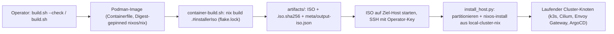

# Cluster NixOS ISO-Builder

Erzeugt den x86_64-NixOS-26.05-Installer zur Bereitstellung der Bare-Metal-Hosts
des lokalen Clusters. Der Build läuft isoliert in einem Digest-gepinnten Podman-
Image; die exakte Nixpkgs-Revision wird durch `flake.lock` gepinnt.

Dieses Repo steht *vorgelagert* zu allem anderen im Monorepo. Es definiert keine
Runtime-Services, keine Networking-, DNS- oder Secrets-Komponenten; es erzeugt nur
das Installer-ISO, das Bare-Metal-Hosts startet, bevor dort NixOS-Konfiguration,
k3s, Cilium, Envoy Gateway oder ArgoCD existieren.

## Die ISO im Downstream-Betrieb

Das ISO ist ein Live-NixOS-Installer zur Bootstrap-Vorbereitung von Ziel-Hosts:

1. Das ISO auf der Ziel-Hardware starten (Knoten des lokalen Clusters). Der
   öffentliche Cluster läuft auf Hetzner-Cloud-vServern, wo keine Custom-ISO
   gemountet werden kann — siehe `public-cluster-nix/docs/operations.md` für
   diesen Pfad.
2. Sich als `root` über SSH in den Live-Installer einloggen. Authentifizierung ist
   Key-only: die Operator-SSH-Keys aus `iso-authorized-keys` sind die einzigen
   akzeptierten Credentials; Passwort- und Keyboard-Interactive-Auth sind
   deaktiviert (`configuration.nix`).
3. Disks partitionieren und formatieren, dann `nixos-install` (`nixos-install-
   tools`) über `install_host.py` aus `cluster-testing` ausführen; dabei auf
   das Host-Flake in `local-cluster-nix` verweisen. Partitionierung erfolgt
   imperativ mit `gptfdisk` (`sgdisk`) + `mkfs`; Disk-UUIDs werden aus
   `hosts/<host>/storage-map.nix` jedes Hosts gelesen, das die einzelne
   Quelle der Wahrheit bleibt.
4. In das installierte System rebootet. Von dort aus laufen NixOS-Konfiguration
   des Knotens (k3s, Cilium CNI, das Envoy-Gateway-Edge im hostNetwork und
   ArgoCD); davon lebt nichts in diesem Repo.

Die im Installer eingebackenen Werkzeuge existieren genau für diesen Bootstrap:
`gptfdisk` (`sgdisk`, Partitionierung), `sops`/`age` (Host-Secrets bei der
Installation dekryptieren), `nixos-install-tools`, die Storage-Stacks
`zfs`/`btrfs-progs`/`lvm2`/`mdadm`/`nfs-utils` und `python3`/`rsync`/`git`
für die Install-Automatisierung. Das ISO trägt selbst keine Secrets; `sops`/
`age` sind für die Post-Boot-Stufe.



## Build

```bash
./build.sh --check
./build.sh
```

`build.sh` ist der Einstiegspunkt; er baut das Podman-Image bei Bedarf und startet
`scripts/container-build.sh` darin. Dieses Script führt den eigentlichen
`nix build` aus und schreibt ISO, Prüfsumme und Metadaten nach `artifacts/`.

Das Verzeichnis `artifacts/` und alle gängigen Image-Formate werden von Git
ignoriert. Ein Referenz-ISO ist nicht erforderlich; Nix baut den Installer
direkt aus den gepinnten Inputs.

Verwenden Sie `REBUILD_IMAGE=1 ./build.sh` oder `./build.sh --rebuild` nach
Änderungen am `Containerfile`.

## Installer-Inhalt

Das Image aktiviert Key-Only-SSH für den konfigurierten Operator-Key. Die
eingebackenen Installer-Werkzeuge sind die in *Die ISO im Downstream-Betrieb*
oben aufgelisteten (`sgdisk` führt die Partitionierung durch), plus gängige
Disk- und Netzwerk-Diagnose-Tools.

## Inputs aktualisieren

Aktualisierungen bewusst im Build-Container durchführen, das Lock-File-Diff
überprüfen, dann einen vollständigen Build ausführen:

```bash
# build.sh bereits gebautes Image weiterverwenden.
image="${NIX_IMAGE:-local/cluster-iso-builder:26.05}"  # build.sh-Default matchen oder NIX_IMAGE setzen
podman run --rm -v "$PWD:/workspace:Z" -w /workspace \
  --entrypoint bash "$image" -lc 'nix flake update'
./build.sh
```

## SSH-Key & ISO-Signatur

- **Autorisierter Installer-SSH-Key (#30):** in `iso-authorized-keys` (ein
  Key je Zeile). Rotation = Datei editieren + rebuild. Es ist ein öffentlicher
  Key (kein Secret); um ihn privat zu halten: `iso-authorized-keys` gitignoren
  und pro Build befüllen (das Flake sieht dann nur getracked-e Dateien — die
  Datei tracken oder mit `--impure` bauen).
- **ISO-Signatur (#32):** optional, mit minisign. Der Secret-Key ist NICHT im
  Repo; zur Build-Zeit übergeben:

  ```bash
  MINISIGN_SECRET_KEY_FILE=~/.minisign/iso.key ./build.sh   # erzeugt <iso>.minisig
  # Verifizieren: minisign -Vm <iso> -P <public-key>
  ```

  Ohne Key wird nur die SHA256-Prüfsumme erzeugt (mit Hinweis).
- **Nix-Sandbox (#31):** erzwungen im rootless-Podman-Container (`nix.conf`
  setzt `sandbox=true`, `sandbox-fallback=false`, sodass ein Build eher
  abbricht, als die Sandbox stillschweigend fallengelassen). Um Nix die
  Sandbox-Einrichtung rootless zu ermöglichen, wird der Container mit
  `--cap-add SYS_ADMIN` und `--security-opt unmask=ALL` gestartet (in
  `build.sh`, nicht `Containerfile`) — breiter als nur eine Mount-Namespace-
  Capability, aber beschränkt auf einen vertrauenswürdigen, ephemeren
  (`--rm`), lokalen Build.

ISOs, Disk-Images, daraus erzeugte Prüfsummen, Build-Metadaten oder lokale
Credentials nicht committe.
