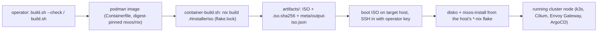

# Cluster NixOS ISO Builder

Builds the x86_64 NixOS 26.05 installer used to provision the local and public
development clusters. The build is isolated in a digest-pinned Podman image;
the exact nixpkgs revision is pinned by `flake.lock`.

This repo sits *upstream* of everything else in the monorepo. It defines no
runtime services, no networking, no DNS and holds no secrets; it only emits the
installer ISO that boots bare-metal hosts before any NixOS config, k3s, Cilium,
Envoy Gateway or ArgoCD exists on them.

## How the ISO is used downstream

The ISO is a live NixOS installer that bootstraps a target host:

1. Boot the ISO on the target hardware (a local-cluster or public-cluster node).
2. SSH into the live installer as `root`. Authentication is key-only: the single
   baked operator ed25519 key is the only accepted credential; password and
   keyboard-interactive auth are refused (`configuration.nix`).
3. Partition and format the disks with `disko`, then lay down the real NixOS
   configuration with `nixos-install` (`nixos-install-tools`), pointing at the
   host's flake in the matching `*-nix` repo (`local-cluster-nix` /
   `public-cluster-nix`).
4. Reboot into the installed system. From there the node runs its NixOS config
   (k3s, Cilium CNI + L2 announcement, the Envoy Gateway edge, ArgoCD, etc.);
   none of that lives in this repo.

The tools baked into the installer exist to support exactly this bootstrap:
`disko` (declarative partitioning), `sops`/`age` (decrypting host secrets during
install), `nixos-install-tools`, the `zfs`/`btrfs-progs`/`lvm2`/`mdadm`/
`nfs-utils` storage stacks, and `python3`/`rsync`/`git` for the install
automation. The ISO carries no secrets itself; `sops`/`age` are for the
post-boot step.



## Build

```bash
./build.sh --check
./build.sh
```

`build.sh` is the entry point; it builds the Podman image if needed and runs
`scripts/container-build.sh` inside it. That script performs the actual `nix build`
and writes the ISO, checksum and metadata to `artifacts/`.

The `artifacts/` directory and all common image formats are ignored by Git.
A reference ISO is not required; Nix builds the installer directly from the
locked inputs.

Use `REBUILD_IMAGE=1 ./build.sh` or `./build.sh --rebuild` after changing the
`Containerfile`.

## Installer contents

The image enables key-only SSH for the configured operator key and includes
the tools needed by the cluster installation automation: Python, rsync,
SOPS/age, disko, ZFS, Btrfs, LVM, mdraid, NFS and common diagnostics.

## Updating inputs

Update deliberately inside the build container, review the lock-file diff,
then run a complete build:

```bash
# Reuse the image build.sh already built. The tag defaults to build.sh's own
# default (or your $NIX_IMAGE override); it is never hard-coded here.
image="${NIX_IMAGE:-$(sed -n 's/.*NIX_IMAGE:-\(.*\)}"/\1/p' build.sh)}"
podman run --rm -v "$PWD:/workspace:Z" -w /workspace \
  --entrypoint bash "$image" -lc 'nix flake update'
./build.sh
```

Do not commit ISOs, disk images, checksums generated for them, build metadata,
or local credentials.
